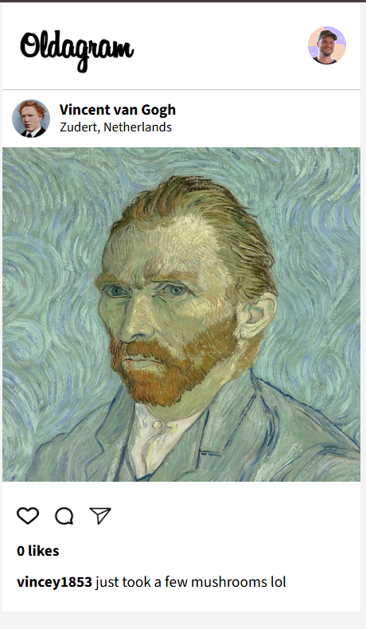

# 📸 Oldagram

A clean and minimal Instagram-style post layout built with HTML, CSS, and JavaScript.  
This project was completed as a **Solo Project** as part of the **Fullstack Career Path** on [Scrimba](https://scrimba.com).

---

## 🚀 Features

- Post card with user avatar, name, and location
- Responsive layout using Flexbox
- Post image with interactive like button
- Dynamic like counter updated via JavaScript
- Google Fonts integration and hover effects on icons
- Organized file structure and semantic HTML

---

## 🛠️ Technologies Used

- HTML5
- CSS3 (Flexbox)
- Vanilla JavaScript

---

## 📸 Preview

---

## 💡 How to Use

1. Open the project in your browser.
2. Click the ❤️ icon to like the post.
3. The number of likes will increase dynamically.
4. Customize user info or add new posts easily in the HTML.

---
